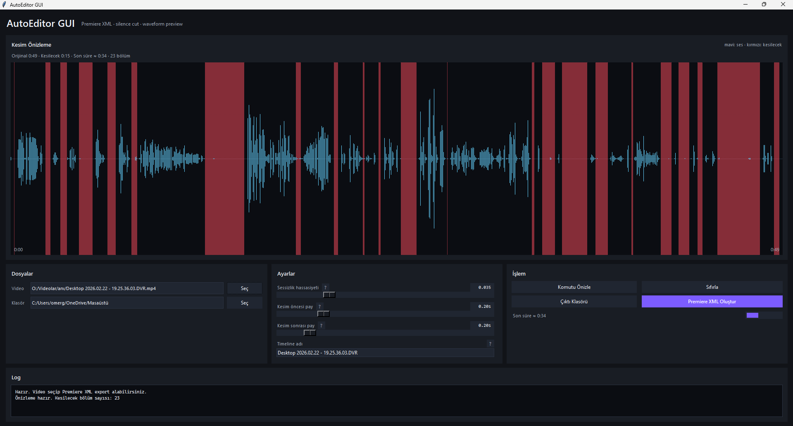

# AutoEditor GUI

Kompakt, sade ve karanlık temalı Windows arayüzü. Video içindeki sessiz bölümleri görsel olarak önizler ve `auto-editor` ile Adobe Premiere Pro için XML timeline export üretir.

## Ekran Görüntüsü



## Kurulum

PowerShell'i proje klasöründe açın ve bağımlılığı kurun:

```powershell
py -m pip install -r requirements.txt
```

Kesim önizlemesinde ses dalgası ve tahmini süre hesabı için `ffmpeg` ve `ffprobe` PATH içinde olmalıdır. FFmpeg indirme sayfası: https://www.ffmpeg.org/download.html

`auto-editor` export için Python paketi kullanılır.

## Çalıştırma

`AutoEditor GUI.bat` dosyasına çift tıklayın.

Alternatif:

```powershell
py app.py
```

## Kullanım

1. Üstteki waveform alanı kesim önizlemesini gösterir.
2. Alt kısımdan video dosyasını ve çıktı klasörünü seçin.
3. `Sessizlik hassasiyeti`, `Kesim öncesi pay` ve `Kesim sonrası pay` slider'larını ayarlayın.
4. Ayarlar değiştikçe önizleme otomatik yenilenir.
5. Kırmızı alanlar kesilecek sessiz bölümleri gösterir.
6. `Premiere XML Oluştur` ile çıktı klasörüne XML üretin.
7. Oluşan XML dosyasını Premiere Pro içinde import edin.

## Çıktı

Çıktı olarak dosya adı seçilmez; sadece klasör seçilir. XML dosyası otomatik olarak şu formatta oluşturulur:

```text
video_adi_premiere.xml
```

## Ayarlar

- `Sessizlik hassasiyeti`: Yükseldikçe daha fazla bölüm sessiz kabul edilir ve kesilir.
- `Kesim öncesi pay`: Kesimden önce bırakılacak kısa tampon süredir.
- `Kesim sonrası pay`: Kesimden sonra bırakılacak kısa tampon süredir.
- `Timeline adı`: Premiere Pro içinde görünecek timeline adıdır.
- `Sıfırla`: Ayarları varsayılan değerlere döndürür.

Her ayarın yanındaki `?` ikonunun üstüne gelerek kısa açıklamasını görebilirsiniz.

## Otomatik Kaydetme

Son kullanılan ayarlar otomatik kaydedilir:

```text
C:\Users\<kullanıcı>\.autoeditor_gui_settings.json
```

## Notlar

- Export komutu temelde `audio:threshold=...,stream=all` mantığını kullanır.
- Sessiz bölümler `speed:99999` ile kesilir, konuşma bölümleri normal hızda kalır.
- Uygulama render almak yerine Premiere Pro için XML timeline dosyası üretir.
- Log alanı en altta küçük tutulmuştur; ayrıntılı işlem çıktıları burada görünür.
